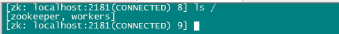
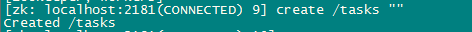
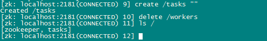
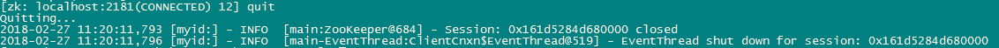

# ZooKeeper-分布式过程协同技术
demo项目
## 一、简介
ZooKeeper是一个分布式的，开放源码的分布式应用程序协调服务，是Google的Chubby一个开源的实现，是Hadoop和Hbase的重要组件。它是一个为分布式应用提供一致性服务的软件，提供的功能包括：配置维护、域名服务、分布式同步、组服务等。

ZooKeeper的目标就是封装好复杂易出错的关键服务，将简单易用的接口和性能高效、功能稳定的系统提供给用户。

ZooKeeper包含一个简单的原语集，提供Java和C的接口。

ZooKeeper代码版本中，提供了分布式独享锁、选举、队列的接口，代码在zookeeper-3.4.3\src\recipes。其中分布锁和队列有Java和C两个版本，选举只有Java版本。
## 二、Zookeeper安装与使用

### 1、下载与安装
进入一下网址：[https://archive.apache.org/dist/zookeeper/](https://archive.apache.org/dist/zookeeper/)，获取最新版本的Zookeeper压缩包，zookeeper-3.4.9.tar.gz，解压可以看到可执行文件、文档、源码、jar包等文件。
Linux系统安装：
1.下载压缩包到指定目录
Cd命令切换到指定命令，使用以下命令下载。

    Wget https://archive.apache.org/dist/zookeeper/zookeeper-3.4.9/zookeeper-3.4.9.tar.gz 

2.解压压缩包

    tar -xvzf zookeeper-3.4.5.tar.gz

### 2、启动Zookeeper服务端和客户端
#### (1).启动服务端
(1)假设你已经下载并解压了ZooKeeper发行包，进入shell，变更目录 （cd）到项目根目录下，重命名配置文件：mv conf/zoo_sample.cfg conf/zoo.cfg
(2)虽然是可选的，最好还是把data目录移出/tmp目录，以防止 ZooKeeper填满了根分区（root partition）。可以在zoo.cfg文件中修改这 个目录的位置。dataDir=/root/data/zookeeper
(3)最后，为了启动服务器，执行以下命令：bin/zkServer.sh start
(4)这个服务器命令使得ZooKeeper服务器在后台中运行。如果在前台 中运行以便查看服务器的输出，可以通过以下命令运行：
bin/zkServer.sh start-foreground
#### (2).启动客户端
在另一个shell中进入项目根目录，运行 以下命令：bin/zkCli.sh

    . . . . . .
     2012-12-06 12:07:23,545 [myid:] - INFO [main:ZooKeeper@438] -① Initiating client connection, connectString=localhost:2181 sessionTimeout=30000 watcher=org.apache.zookeeper. ZooKeeperMain$MyWatcher@2c641e9a Welcome to ZooKeeper! 
    2012-12-06 12:07:23,702 [myid:] - INFO [main-SendThread② (localhost:2181):ClientCnxn$SendThread@966] - Opening socket connection to server localhost/127.0.0.1:2181. Will not attempt to authenticate using SASL (Unable to locate a login configuration) JLine support is enabled 
    2012-12-06 12:07:23,717 [myid:] - INFO [main-SendThread③ (localhost:2181):ClientCnxn$SendThread@849] - Socket connection established to localhost/127.0.0.1:2181, initiating session [zk: localhost:2181(CONNECTING) 0] 
    2012-12-06 12:07:23,987 [myid:] - INFO [main-SendThread④ (localhost:2181):ClientCnxn$SendThread@1207] - Session establishment complete on server localhost/127.0.0.1:2181, sessionid = 0x13b6fe376cd0000, negotiated timeout = 30000 WATCHER:: WatchedEvent state:SyncConnected type:None path:null⑤ 

①客户端启动程序来建立一个会话。 

②客户端尝试连接到localhost/127.0.0.1：2181。

③客户端连接成功，服务器开始初始化这个新会话。 

④会话初始化成功完成。 

⑤服务器向客户端发送一个SyncConnected事件。

### 3、简单命令
#### (1).列出根目录所有znode
命令： ls /

#### (2).创建znode
命令：create /workers ""

含义：创建名为“workers”的znode，并存储空字符串数据。

#### (3).删除znode
命令：delete /workers

#### (4).退出命令（quit）

#### (5).ZooKeeper服务器（bin/zkServer.sh stop）

## 三、ZooKeeper的应用
### 1、ZooKeeper可用特性：
1.跟踪事件的有效机制

2.异步API

3.设置监视点，获取通知。可以实现发布订阅。

4.有序节点。可以实现分布式锁、分布式队列。

5.Multiop特性：事务原子性、检测版本号。

### 2、ZooKeeper在系统中的应用：
#### 1.Apache HBase
ZooKeeper用于选举一个集群内的主节点，以便跟踪可用的服务 器，并保存集群的元数据。

#### 2.Apache Kafka
其中 ZooKeeper用于检测崩溃，实现主题（topic）的发现，并保持主题的生 产和消费状态。kafka通过zookeeper实现生产者在消费端的负载均衡，动态的集群扩展等等。

#### 3.Apache Solr
它使用ZooKeeper来存储集群的元数据，并协作更新这些元数据。

#### 4.Yahoo！Fetching Service
该服务采用ZooKeeper实现主节点选举、崩溃检测和 元数据存储。

#### 5.Facebook Messages
该应用将 ZooKeeper作为控制器，用来实现数据分片、故障恢复和服务发现等功 能。

**总结：这些系统应用ZooKeeper实现的点有：主从模式、存储集群元数据、崩溃检测、服务发现、故障恢复、数据分片。**
**可以理解为一个分布式的带有订阅功能的小型元数据库。**

### 3.收藏地址
[Zookeeper在哪些系统中使用，又是怎么用的？](https://www.zhihu.com/question/35139415)

[【分布式】Zookeeper应用场景](https://www.cnblogs.com/leesf456/p/6036548.html)

## 四、各场景的案例实现
#### 1.监听点可以在创建节点之前创建；
#### 2.针对于某个znode的监听点（子节点改变或数据改变），可以在其他znode创建；
#### 3.数据的发布与订阅模式。（数据发生改变、节点发生改变）

Manage Server 程序 工作流程

Work Server程序主体流程

#### 4.Stat对象记录，节点的版本号，节点上一次更新的时间戳。且监听数据改变需要传入Stat对象，记录节点的信息状态。
#### 5.主从模式：多个节点争夺创建/master节点，某个已成为主节点的节点再完成任务或达到条件后，释放节点（即删除节点），就会被其他节点应用。其中引入线程池，实现多线程争抢成为主节点。

#### 6.分布式锁：
http://blog.csdn.net/jerome_s/article/details/52335002
一般的锁是指单进程多线程的锁，在多线程并发编程中，用于线程之间的数据同步，保证共享资源的访问。而分布式锁，指的是在分布式环境下，保证跨进程、跨主机、跨网络的共享资源，实现互斥访问，保证一致性。

#### 7.分布式队列
http://blog.csdn.net/jerome_s/article/details/52335021
在传统的单进程编程中，我们使用队列来存储数据结构，用来在多线程之间共享或者传递数据。在分布式环境下，同样需要一个类似单进程的组件， 用来实现跨进程、跨主机、跨网络的数据共享和数据传递。这就是我们的分布式队列。Zookeeper可以通过顺序节点来实现分布式队列。

#### 8.命名服务
http://blog.csdn.net/jerome_s/article/details/52335042

#### 9.负载均衡
http://blog.csdn.net/jerome_s/article/details/52334978
